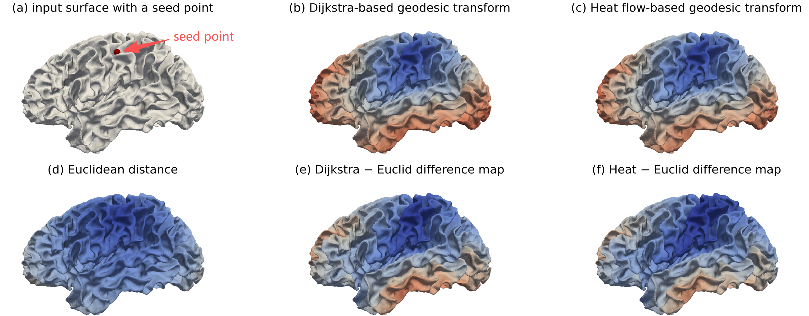
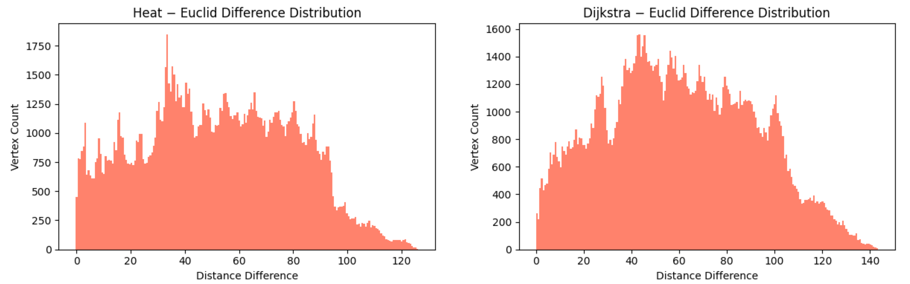

# GeoSurf 🧭
*A lightweight Python toolkit for geodesic and Euclidean distance transforms on surface meshes.*

---

## Overview

**GeoSurf** provides an easy command-line interface (CLI) and Python functions to compute
distance transforms on 3D surface meshes (e.g., cortical surfaces, anatomical or geometric models).

It supports three major algorithms:
- **Dijkstra** – Graph-based shortest path (approximate geodesic)
- **Heat** – Fast and accurate heat-method geodesic (via `potpourri3d`)
- **Euclid** – Straight-line 3D distance (baseline reference)

---

*Geodesic and Euclidean distance visualizations on the cortical surface.Top row shows the input with seed and two geodesic transforms; bottom row shows Euclidean distance and the difference maps (Heat−Euclid, Dijkstra−Euclid).*

*A comparison of vertex-wise distance difference distributions. (a) shows the difference between heat-based and Euclidean distances, (b) shows the difference between Dijkstra-based and Euclidean distances.*
## Features

- 🔹 Read and write both `.vtk` (legacy) and `.vtp` (XML) PolyData formats  
- 🔹 Compute per-vertex distance to one or multiple seed points  
- 🔹 Output results as scalar arrays ready for visualization in ParaView or FreeView  
- 🔹 CLI and library-level API (both supported)  
- 🔹 Cross-platform, lightweight dependencies  

---

## Installation

```bash
git clone https://github.com/<your-username>/GeoSurf.git
cd GeoSurf

# Create a virtual environment (recommended)
python3 -m venv venv
source venv/bin/activate

# Install dependencies
pip install -r requirements.txt
```
## CLI Usage
```bash
# Heat-based geodesic (requires potpourri3d)
geosurf --vtk lh.white.vtk --seed-id 123 --algo heat --out lh.white_heat.vtk

# Dijkstra-based geodesic with multiple seeds
geosurf --vtk surf.vtp --seeds 10,42,77 --algo dijkstra --combine min --out out.vtp

# Euclidean baseline
geosurf --vtk lh.white.vtk --seed-id 123 --algo euclid --out lh.white_euclid.vtk
```
## Python API
```bash
from geosurf.transform import read_polydata, compute_heat_potpourri

poly = read_polydata("lh.white.vtk")
out = compute_heat_potpourri(poly, seeds=[123], array_name="HeatDist")
```
## Acknowledgments
* [VTK](https://vtk.org/) for mesh handling
* [Potpourri3D](https://github.com/nmwsharp/potpourri3d) for the heat method implementation
* This project was inspired by practical needs in neuroimaging surface analysis workflows.

